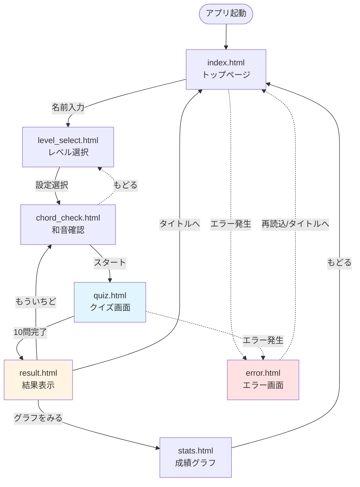
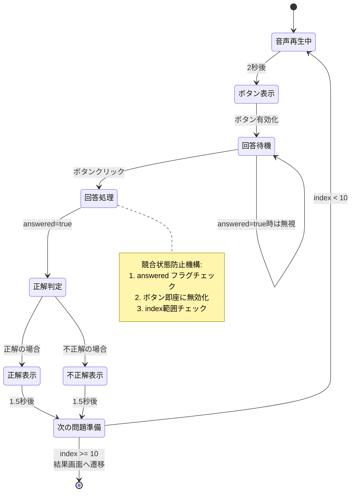
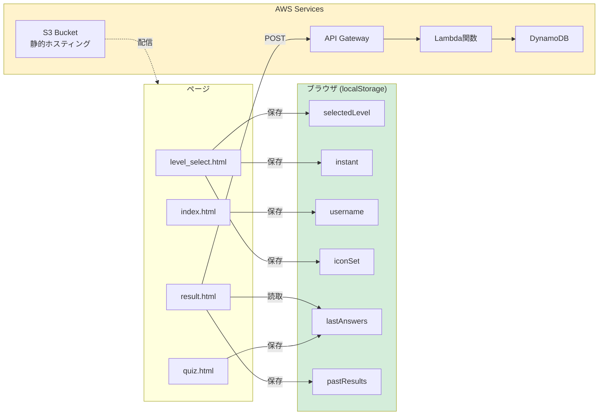

# 和音当てクイズアプリ

子供向けの音楽教育アプリケーション。和音（コード）の音を聞いて、正しい色を選ぶクイズゲームです。

## 📊 イベントフロー図

### ユーザージャーニー全体図



### クイズ画面の詳細フロー



### データフロー図



## 🎯 主な機能

### 1. レベル選択 (1-13)
- 和音の種類が段階的に増加
- レベル1: 2種類の和音
- レベル13: 14種類の和音

### 2. 解答モード
- **すぐにこたえをみる**: 即座に正誤判定（子供向け）
- **あとでこたえをみる**: 確定ボタンで判定（学習モード）

### 3. アイコン選択
- **どうぶつ**: 動物イラストで視覚的にサポート
- **のりもの**: 乗り物イラスト
- **なし**: 色のみ

### 4. 誤操作防止機能 (子供向け最適化)
- ✅ ピンチズーム無効化
- ✅ ダブルタップズーム無効化
- ✅ テキスト選択無効化
- ✅ 長押しメニュー無効化
- ✅ 競合状態防止（連打対策）

### 5. 成績記録
- **ローカル**: `localStorage`に最新20件保存
- **クラウド**: AWS DynamoDBに永続保存
- **グラフ表示**: Chart.jsで成績推移可視化

## 🛠 技術スタック

### フロントエンド
- **HTML5** + **Tailwind CSS**: レスポンシブUI
- **Vanilla JavaScript**: 軽量で高速
- **Vue.js**: 一部ページで使用
- **Chart.js**: 成績グラフ表示

### バックエンド（オプション）
- **AWS S3**: 静的ホスティング
- **AWS API Gateway**: REST API
- **AWS Lambda**: Python 3.12
- **AWS DynamoDB**: NoSQLデータベース

### 音声ファイル
- **MP3形式**: `static/sounds/`配置
- **命名規則**: `01_red.mp3`, `02_yellow.mp3`...

## 🚀 実行方法

### ローカル開発

```bash
npx http-server -p 8080
# ブラウザで `http://127.0.0.1:8080/` を開く
```

### WSL環境の場合

管理者権限で以下のコマンドを実行：

```bash
netsh.exe interface portproxy add v4tov4 listenaddress=[host ip_addr] listenport=8080 connectaddress=[wsl ip_addr] connectport=8080
```

### AWS環境へのデプロイ

詳細は [docs/AWS_SETUP.md](docs/AWS_SETUP.md) を参照してください。

## 📁 プロジェクト構成

```
chord_quiz/
├── index.html              # トップページ（名前入力）
├── level_select.html       # レベル・設定選択
├── chord_check.html        # 和音確認ページ
├── quiz.html              # クイズ本体
├── result.html            # 結果表示
├── stats.html             # 成績グラフ
├── error.html             # エラーページ
├── admin.html             # 管理画面
├── static/
│   ├── style.css          # カスタムスタイル
│   ├── site.js            # 共通ロジック
│   ├── config.js          # API設定
│   ├── sounds/            # 音声ファイル
│   │   ├── 01_red.mp3
│   │   ├── 02_yellow.mp3
│   │   └── ...
│   └── images/            # アイコン画像
│       ├── animals/       # 動物アイコン
│       └── vehicles/      # 乗り物アイコン
├── backend/               # Lambda関数
│   └── lambda_function.py
└── docs/                  # ドキュメント
    └── AWS_SETUP.md       # AWS設定ガイド
```

## 🔧 主要コンポーネント

### site.js
- `generateQuiz()`: クイズ問題生成（連続回避ロジック）
- `createChordButton()`: 和音ボタン動的生成
- `getSoundsForLevel()`: レベル別音声ファイル取得

### quiz.html
- **競合状態防止機構**:
  1. `answered`フラグで重複回答防止
  2. ボタン即座無効化
  3. `index`範囲チェック（オーバーフロー防止）
- **自動進行**: 1.5秒後に次の問題へ

### result.html
- **ローカル保存**: `pastResults`に追加
- **AWS送信**: API Gateway経由でDynamoDBへ
- **評価メッセージ**: 正解率に応じた励まし

## 📱 モバイル最適化

### タッチ操作
- `touch-action: manipulation`: ダブルタップズーム無効
- `user-select: none`: テキスト選択無効
- `-webkit-touch-callout: none`: 長押しメニュー無効

### ビューポート設定
```html
<meta name="viewport" content="width=device-width, initial-scale=1, maximum-scale=1, user-scalable=no" />
```

### レスポンシブグリッド
- モバイル: 2列レイアウト
- タブレット以上: 4列レイアウト

## 🐛 トラブルシューティング

### 音声が再生されない
- ブラウザの自動再生ポリシーを確認
- `static/sounds/`に音声ファイルが存在するか確認

### AWSへの送信が失敗する
- `static/config.js`のAPI_ENDPOINTを確認
- CORSが正しく設定されているか確認

### 回答数が10を超える
- 最新版に更新（競合状態修正済み）
- ブラウザキャッシュをクリア

## 📄 ライセンス

このプロジェクトは教育目的で作成されています。